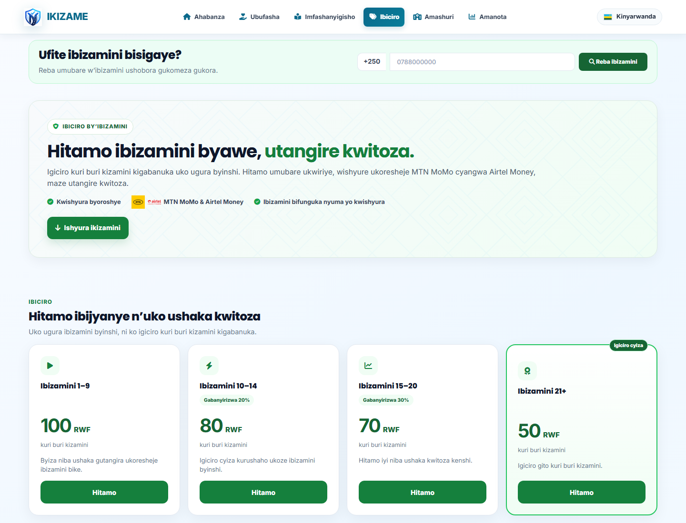
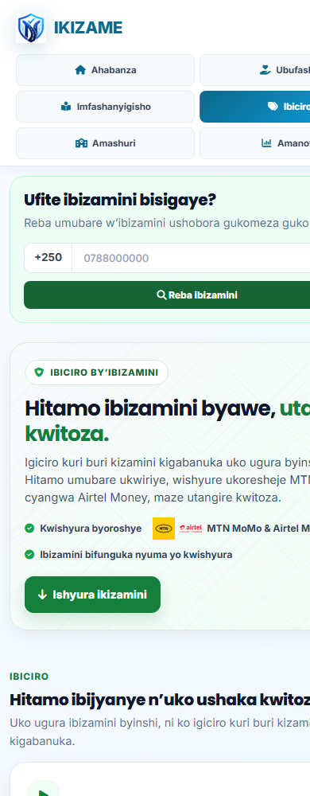

# Payment UX validation

This change is presentation-only. It does not alter PayPack endpoints, prices, request payloads, or server-side payment state.

## Screenshots

## Manual visual checklist

- [x] Desktop pricing shows the existing four tiers, provider information, and the new payment jump action.
- [x] The mobile layout uses wrapping cards and a compact two-column public navigation.
- [x] The home introduction is visually separated below the sticky navigation and its three labels wrap.
- [x] About and Terms use the shared public navigation, footer, light surface cards, spacing, and responsive width.
- [x] Checkout errors stay in the form, announce through an ARIA live region, can be dismissed, and move focus without trapping it.
- [x] Browser timeout and network ambiguity say to wait/check the balance rather than to pay again.
- [x] The payment jump scrolls and focuses the existing price section without selecting a tier or starting checkout.

## Automated checks

`npm test` — 45 passing tests.

`npm audit --omit=dev --audit-level=high` — zero vulnerabilities.

The payment interactions in the checks are local HTML/JS mocks and static assertions; no PayPack request or live payment is initiated.
